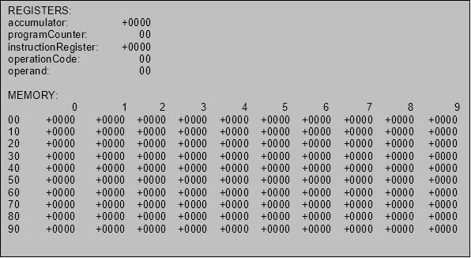
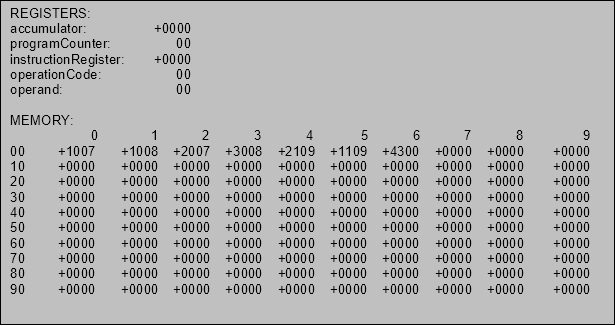
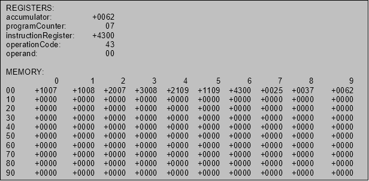
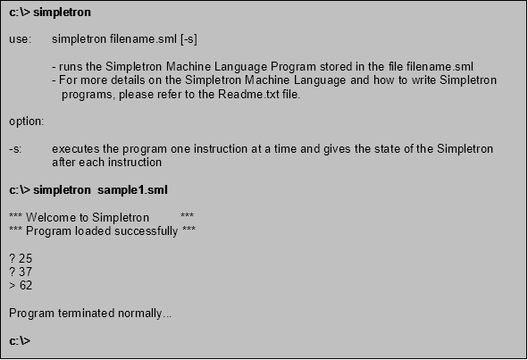
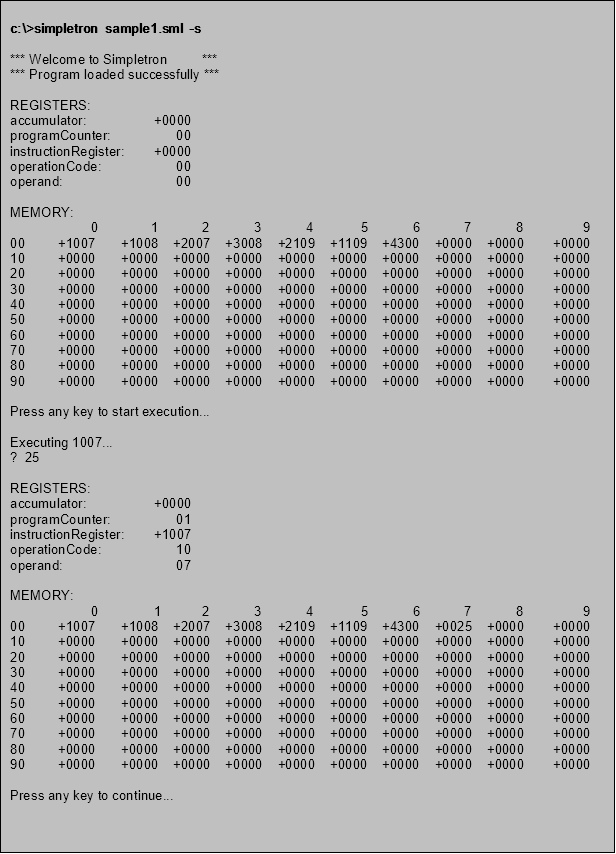
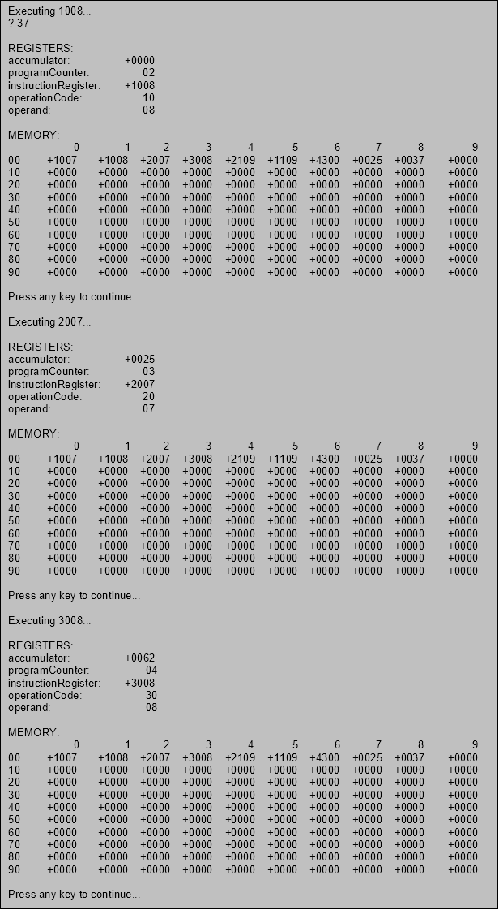
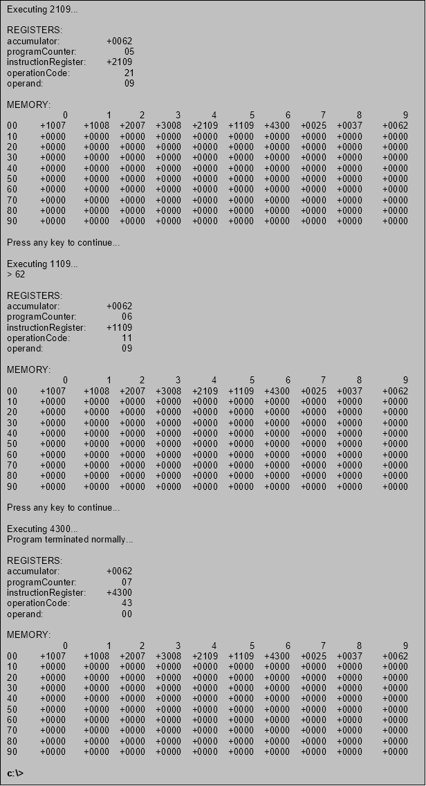

**Programming Project 1: 	SIMPLETRON Simulator (The Bare Machine)**

The **SIMPLETRON** Computer

- The Simpletron Computer contains an *accumulator-*a special register in which information is put before the Simpletron uses that information in calculations or examines it in various ways. 
- All information in the Simpletron is handled in terms of *words*. A word is a signed four-digit decimal number such as +3361, -1234, +0407, -0001 etc.
- The Simpletron is equipped with a 100-word memory and these words are referenced by their location numbers 00,01,002,..,99
- Before running an SML (Simpletron Machine Language) program, the program should be loaded in memory. The first instruction is always placed in location 00. The simulator will start executing at this location.
- Each instruction written in SML occupies one word of the Simpletron's memory (and hence instructions are 4-digit decimal numbers).  Each location in the Simpletron's memory may contain either an instruction, a data value used by a program or an unused (and hence undefined) area of memory. 
- The first 2 digits of each SML instruction are the operation code specifying the operation to be performed. SML operation codes are summarized in the table  below.
- The last two digits of an SML instruction represent the operand. The operand can be any of the following:
- the address of the memory containing the word to which the operation applies
- the memory location where the jump will take place
- an immediate operand to be used in the operation

**SIMPLETRON MACHINE LANGUAGE INSTRUCTIONS**

**Operation Code	Meaning**

*Input/Output Operations*

Read 	= 10		- Read a word from the keyboard into a specific location in memory

Write     = 11		- Write a word from a specific location in memory to the screen

*Load/Store Operations*

LoadM 	 = 20		- Load a word from a specific location in memory into the accumulator

Store	 = 21		- Store a word from the accumulator into a specific location in memory

LoadI     = 22		- Load an immediate value (00-99) into the accumulator.  The 2 digit 

operand becomes the immediate value to be loaded in the accumulator.

*Arithmetic Operations*

*operand comes from memory*

AddM 	= 30		- Add a word from a specific location in memory to the word in the 

`  `accumulator (leave the result in the accumulator)

SubM   = 31		- Subtract a word from a specific location in memory from the word in 

`  `the accumulator (leave the result in the accumulator)

DivM    = 32		- Divide the accumulator by the word from a specific location in memory 

`  `(leave the result in the accumulator)

ModM  = 33		- Perform the modulo operation between the word in the memory 

`  `location and the contents of the accumulator (leave the remainder in   

`  `the accumulator)

MulM    =34		- Multiply a word from a specific location in memory to the word in the 

`  `accumulator (leave the result in the accumulator)

*operand is immediate*

AddI   = 35		- Add the immediate operand represented by the next 2 digits to the 

`  `word in the accumulator (leave the result in the accumulator)

SubI   = 36		- Subtract the immediate operand represented by the next 2 digits from 

`  `the  word in the accumulator (leave the result in the accumulator)

DivI    = 37		- Divide the accumulator by the immediate operand represented by the 

`  `next 2 digits (leave the result in the accumulator)

ModI  = 38		- Perform the modulo operation on the accumulator and the immediate 

`  `operand represented by the next 2 digits(leave the result in the 

`  `accumulator)

MulI    =39		- Multiply the immediate operand represented by the next 2 digits to the 

`  `word in the accumulator (leave the result in the accumulator)

*Transfer of Control Operations*

JMP   = 40		- Jump to a specific location in memory

JN     = 41		- Jump to a specific location in memory if the accumulator is negative

JZ     = 42		- Jump to a specific location in memory if the accumulator is 0		

HALT = 43		- Halt - this program has completed its task

Example 1:	This SML program reads two numbers from the keyboard and computes and prints their sum.

`	`**Memory Location		SML Instruction			Description**

`	`00				1007				Read A

`	`01				1008				Read B

`	`02				2007				LoadM A

`	`03				3008				AddM B

`	`04				2109				Store C

`	`05				1109				Write C

`	`06				4300				Halt

`	`07				0000				Variable A

`	`08				0000				Variable B	

`	`09				0000				Result C

Example 2:	This SML program reads two numbers from the keyboard and determines and prints the larger value.

`	`**Memory Location		SML Instruction			Description**

`	`00				1009				Read A

`	`01				1010				Read B

`	`02				2009				LoadM A

`	`03				3110				SubM B

`	`04				4107				Jump if Negative to 07

`	`05				1109				Write A

`	`06				4008				Jump to 08

`	`07				1110				Write B

`	`08				4300				Halt	

`	`09				0000				Variable A

`	`10				0000				Variable B

Exercises:	Write SML Programs for the following:

1\.	Write an SML program that will read a number and will output 1 if the number is an even number, will output 0 otherwise.

2\.	Write a program that will read 10 numbers (using a loop) and will output the sum of the numbers.

3\.	Write a program that will read 10 numbers (using a loop) and will output the largest of the 10 numbers.The **SIMPLETRON SIMULATOR/INTERPRETER**

1\.	The Simpletron instructions are stored in a text file (*filename.sml*) in the following format:

00	1007		; Read A

`	`01	1008		; Read B

`	`02	2007		; LoadM A

`	`03	3008		; AddM B

`	`04	2109		; Store C

`	`05	1109		; Write C

`	`06	4300		; Halt

`	`07	0000		; Variable A

`	`08	0000		; Variable B	

`	`09	0000		; Result C

- The first column represents the address of the instruction and it can be placed in any column number.
- The second column is the actual Simpletron machine language instruction
- Anything after the semicolon ; is considered as comment

2\.	Your program should accept through command line parameters --> the name of the text file (program) followed by certain options as follows:

**c:\> simpletron** 

// should give out details on how to run the program

**c:\> simpletron sample1.sml**

// should run the program until completion

**c:\> simpletron sample1.sml -s**

// should run the program one line at a time and should give registers 

// and memory dump after each instruction

3\.	The SML program should be loaded in memory that is simply represented as an array of 100 elements.

4\.	The Simpletron computer has the following registers:

`	`**accumulator** 		- 	to hold data to be operated on

**programCounter**	- 	to keep track of the next instruction to be executed in 

memory 

`	`**instructionRegister**	-	holds the instruction being executed

`	`**operationCode**	-	to hold the operation code represented by the 2 left 

digits of an instruction

`	`**operand**		-	to hold the operand which is represented by the 2 right 

digits of the instruction

5\.	The interpreter should simulate the *instruction execution or the fetch-decode-execute cycle.**  After loading the SML program in memory, the **programCounter** is initialized to 00 because the first instruction is always at location 00. The program then repeatedly f*etches* the next instruction from memory, transfers the instruction to the **instructionRegister** and increments the **programCounter** so that it points to the next instruction to be executed.  Next, the interpreter "picks of" the first 2 digits and transfers it to the **operationCode** register and the last 2 digits to the **operand** register. It then *decodes* the instruction to determine what kind of instruction is that and then *executes* the operation defined by the **operationCode***.* 

6\.	You have to design your program properly to allow easy addition of instructions in case we want to "upgrade" our Simpletron machine.

7\.	Given below is a sample **dump** of the state of the Simpletron before any program is loaded.

8\.	Given below is the state of the Simpletron after loading the example program in #1.

9\.	Given below is the state of the Simpletron after executing the example program in #1. Assuming the user inputs 25 and 37 respectively.

9\.	If the Simpletron simulator is run without the -s (step by step) option. The following is a sample run of the program:

10\.	Given below is a sample screen shot of the execution of the example program in number 1 with 25 and 37 as input.

**SIMPLETRON INSTRUCTION GUIDE**

|**Instruction**|**Description**|**Mnemonic**|
| :-: | :-: | :-: |
|10dd|[dd] <-- keyboard|read x|
|11dd|[dd] --> screen|write x|
|1200|acc à screen|write acc|
|13dd|dd à screen|write dd|
|20dd|acc <-- [dd]|load x|
|21dd|acc --> [dd]|store x|
|22dd|acc <-- dd|load v|
|30dd|acc <-- acc + [dd]|add x|
|31dd|acc <-- acc - [dd]|sub x|
|32dd|acc <-- acc / [dd]|div x|
|33dd|acc <-- acc % [dd]|mod x|
|34dd|acc <-- acc \* [dd]|mul x|
|35dd|acc <-- acc + dd|add v|
|36dd|acc <-- acc – dd|sub v|
|37dd|acc <-- acc / dd|div v|
|38dd|acc <-- acc % dd|mod v|
|39dd|acc <-- acc \* dd|mul v|
|40dd|pc <-- dd|jmp a|
|41dd|if (acc < 0) pc <-- dd|jl a|
|42dd|if (acc = 0) pc <-- dd|jz a|
|4300|program terminated|halt|

Legend:		acc:	accumulator

`			`x:	represents a memory location containing a value

`			`v:	represents an immediate data value

`			`a:	represents an address/ memory location 

